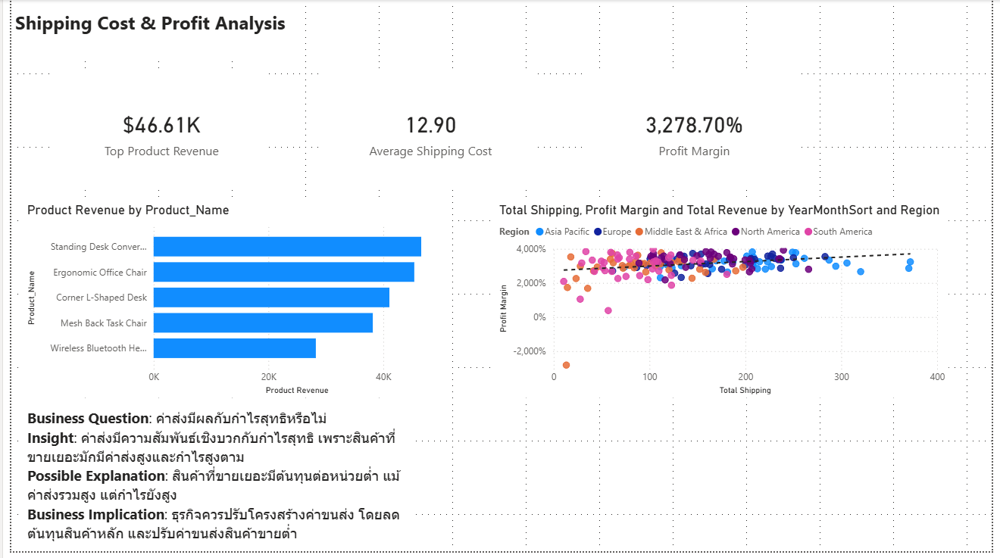
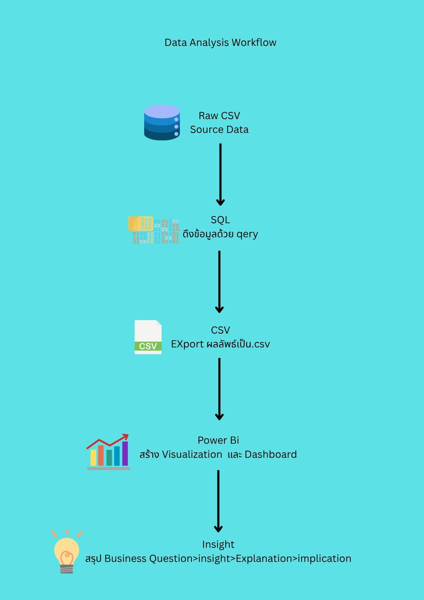

# Project Title: Global Ecommerce Analysis

## 📌 Executive Summary
This project analyzes global e-commerce performance focusing on revenue, customer loyalty, and shipping efficiency using Power BI and SQL.

---

## 📊 Dashboard Overview
- Page 1: overview_dashboard

  

- Page 2: Customers & Order Analysis

  

- Page 3: Shipping Cost % Profit Analysis

  

---

## 🔑 Key KPIs
### 💰 Revenue Metrics
- Total Revenue  
- Product Revenue  
- Revenue New  
- Revenue Repeat  

### 💵 Profit Metrics
- Total Profit  
- Profit Margin  

### 👥 Customer Metrics
- Total Customers  
- New Customers  
- Repeat Customers  
- Repeat Customer Rate  

### 📦 Product Metrics
- Top Product Category  
- Top Product Revenue  

### 🚚 Shipping Metrics
- Total Shipping  
- Average Shipping Cost  

### ⚙️ Efficiency Metrics
- Average Order Value (AOV)

---

## ❓ Business Questions & Insights

  

---

### 🧩 Business Question
ลูกค้าซื้อซ้ำมีความสัมพันธ์กับยอดขายอย่างไร

### 💡 Insight
ในช่วงต้นปีของทุกปี ยอดขายและจำนวนลูกค้าซื้อซ้ำลดลงพร้อมกัน สะท้อนถึงผลของฤดูกาล (seasonality)

### 🔍 Possible Explanation
ในไตรมาสแรกของแต่ละปี ลูกค้ามักซื้อซ้ำน้อยลง ส่งผลให้ยอดขายลดลงตาม

### 🚀 Business Implication
ทควรออกโปรโมชั่นที่สอดคล้องกับฤดูกาล เพื่อกระตุ้นยอดขายและเพิ่มความเสถียรของรายได้ตลอดทั้งปี

---

### 🧩 Business Question
กำไรสอดค้ลองกับรายได้ต่อเดือนหรือไม่

### 💡 Insight
ในช่วง2ปีแรก กำไรยังไม่คงที่เริ่มมาคงที่ในช่วงปี2025 อาจจะเนื่องมาจากยังเป็นช่วงแรกธรุกิจทำให้ยังไม่เกิดการstableของธรุกิจ

### 🔍 Possible Explanation
เนื่องจากมีลูกค้ากลับมาซื้อซ้ำแค่25% ธุระกิจยังพึ่งพาลูกค้าใหม่เยอะเกิดไปทำให้กำไรยังไม่มีหมั่นคง

### 🚀 Business Implication
จัดโปรโมชั่นสำหรับการดึงลูกค้าหรือมีการสะสมคะแนนสำหรับทุกorderแลกของรางวัลเพื่อเพิ่มความloyaltyของลูกค้า

---

  

---

### 🧩 Business Question
กลูกค้าซื้อซ้ำคือลูกค้าหลักหรือไม่

### 💡 Insight
ลูกค้าใหม่เป็นลูกค้าหลักของธุรกิจเราในทุกsegmentอาจทำให้ในระยะยาวส่งผลต่อให้ธุรกิจขาดทุนได้

### 🔍 Possible Explanation
ลูกค้าโดยรวมของธุรกิจเป็นลูกค้าใหม่75%อาจะส่งผลระยะยาวให้ธุรกิจขาดทุนได้

### 🚀 Business Implication
ทำการจัดโปรโมชั่นลดราคาสำหรับการซื้อของครั้งถัดไปเพื่อกระตุ่นให้คนอยากกลับมาซื้อซ้ำเพื่อให้ธุรกิจกำไรมากขึ้น

---

### 🧩 Business Question
สินค้าแต่ละหมวดหมู่สร้างรายได้แตกต่างกันอย่างไรในแต่ละภูมิภาค

### 💡 Insight
หมวด Furniture มียอดขายสูงสุดในทุกภูมิภาค โดยเฉพาะยุโรปและเอเชียแปซิฟิก ในขณะที่หมวด Office Supplies มียอดขายต่ำสุด ซึ่งแสดงถึงการพึ่งพาหมวด Furniture เป็นหลักของธุรกิจ

### 🔍 Possible Explanation
ความนิยมในสินค้าหมวด Furniture อาจเกิดจากการเป็นสินค้าหลักที่ลูกค้าซื้อซ้ำบ่อย ในขณะที่ Office Supplies มีความต้องการต่ำกว่า ทำให้รายได้รวมของหมวดนี้ไม่สูง

### 🚀 Business Implication
ธุรกิจควรสร้างกลยุทธ์ bundle promotion โดยจับคู่สินค้าหมวด Furniture กับ Office Supplies เพื่อกระตุ้นยอดขายของหมวดที่อ่อนกว่า และลดความเสี่ยงจากการพึ่งพาหมวดเดียวมากเกินไป

---

  

---

### 🧩 Business Question
ค่าส่งมีผลกับกำไรสุทธิหรือไม่

### 💡 Insight
ค่าส่งมีความสัมพันธ์เชิงบวกกับกำไรสุทธิ เพราะสินค้าที่ขายเยอะมักมีค่าส่งสูงและกำไรสูงตาม

### 🔍 Possible Explanation
สินค้าที่ขายเยอะมีต้นทุนต่อหน่วยต่ำ แม้ค่าส่งรวมสูง แต่กำไรยังสูง

### 🚀 Business Implication
ธุรกิจควรปรับโครงสร้างค่าขนส่ง โดยลดต้นทุนสินค้าหลัก และปรับค่าขนส่งสินค้าขายต่ำ

---

### 🧩 Business Question
ค่าส่งมีผลกับกำไรสุทธิหรือไม่

### 💡 Insight
ค่าส่งมีความสัมพันธ์เชิงบวกกับกำไรสุทธิ เพราะสินค้าที่ขายเยอะมักมีค่าส่งสูงและกำไรสูงตาม

### 🔍 Possible Explanation
สินค้าที่ขายเยอะมีต้นทุนต่อหน่วยต่ำ แม้ค่าส่งรวมสูง แต่กำไรยังสูง

### 🚀 Business Implication
ธุรกิจควรปรับโครงสร้างค่าขนส่ง โดยลดต้นทุนสินค้าหลัก และปรับค่าขนส่งสินค้าขายต่

---

## ⚙️ How to Use
1. เปิดไฟล์ `.pbix` ใน Power BI  
2. เลือกหน้า Dashboard ตามหมวด  
3. ใช้ filter (เช่น Date, Product Category) เพื่อเจาะลึกข้อมูล  

---

## 📂 Dataset Details
- Source: kaggle
- Rows: 2,001  
- Columns: 15 
- Key Fields:
    Order_ID,Order_Date,Customer_Name,Customer_Segment,Country,Region,Product_Category,Product_Name,
    Quantity,Unit_Price,Discount,Total_Sale,Shipping_Cost,Profit,Payment_Method

---

## 🧰 Data Tools
- **SQL (SQLite)** → ใช้ในการ query และเตรียมข้อมูล  
- **Power BI** → ใช้สร้าง dashboard และวิเคราะห์เชิง visualization  
- **Excel / CSV** → ใช้ตรวจสอบและจัดรูปแบบข้อมูลเบื้องต้น  
- **DAX** → ใช้สร้าง measure และ KPI ใน Power BI  

---

## 🔄 Data Flow

  

1. **Data Collection:** ดึงข้อมูลจาก Kaggle dataset  
2. **Data Preparation:** ทำความสะอาดข้อมูลด้วย SQL (เช่น ลบ missing values, ปรับ format วันที่)  
3. **Data Modeling:** สร้าง star schema ใน Power BI (Fact: global_ecommerce_sales, Dimension: Date, Region, Product, Customer)  
4. **Visualization:** สร้าง dashboard 3 หน้า (Overview, Customer & Order, Shipping & Profit)  
5. **Insight Generation:** วิเคราะห์ KPI และเขียน Business Questions & Insights ลงใน README

--- 

## 📈 Business Impact
- ช่วยวิเคราะห์ช่วงเวลาเหมาะสมในการทำโปรโมชั่น  
- ระบุสินค้าที่ควรปรับปรุงคุณภาพ  
- เสนอแนวทางเพิ่ม retention ของลูกค้า  

---

## 🚀 Future Work 
- ทดลอง Predictive Modeling (เช่น Revenue Forecast)  
- เพิ่ม KPI ใหม่ เช่น Customer Lifetime Value  

---

## 📎 Files Included
- `/dashboard/project.pbix` → Power BI file  
- `/sql/queries.sql` → SQL scripts  
- `/data/raw.csv` → Dataset  
- `/images/` → Dashboard screenshots  

